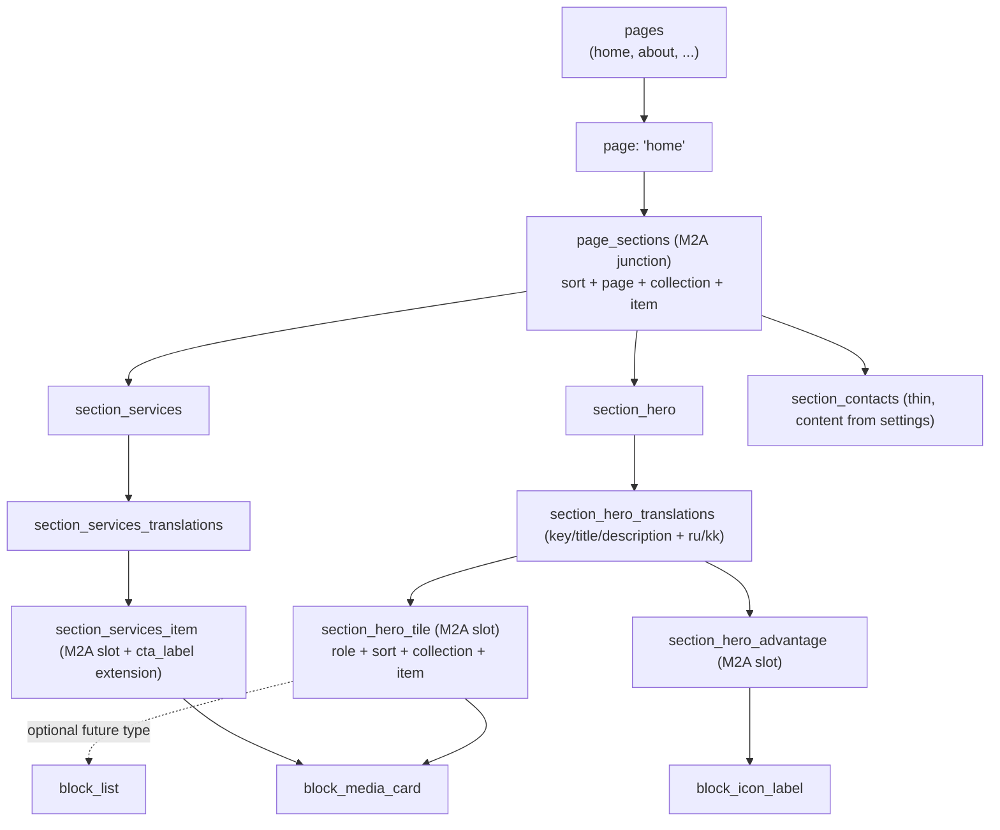

# Core-модель: settings, pages, sections, blocks

См. [README.md](README.md) для карты остальных файлов. Обоснование, почему core маленький, а не одна большая схема — в [why-not-one-schema.md](why-not-one-schema.md). Композиция примитивов в блоки — в [why-not-one-schema.md](why-not-one-schema.md) § «монолитные типы вместо композиции».

## Проблема, которую решает эта модель

Бесхитростный путь — content-модель, где у каждой секции страницы своя выделенная singleton-коллекция (`section_hero`, `section_services`, ...) и порядок/видимость управляется закрытым enum'ом (`section_key`). Это даёт редактору контроль над порядком и видимостью без хардкода индекса — но номенклатура секций жёстко зашита в код и схему конкретного сайта, а содержимое каждой секции — тоже жёсткий монолит (один набор полей на весь тип). У второго клиента неизбежно будет другой набор секций, а содержимое одной и той же секции у разных клиентов может отличаться по типу контента (картинка/видео/список) — форкать схему и компоненты под каждый случай не вариант.

## Три уровня, не два — терминология зафиксирована

- **Page** — маршрут сайта (`home`, `about`, ...). Коллекция `pages`.
- **Section** — именованная композиционная единица страницы, подключается к странице через M2A (`page_sections`). Типы: `section_hero`, `section_services`, `section_symptoms`, `section_we_help`, `section_contacts`. Каждая — базовый контракт (key/title/description) + свои top-level поля + один или несколько повторяющихся **слотов**.
- **Block** — атомарный, полиморфный примитив контента внутри слота секции. Типы: `block_media_card`, `block_icon_label`, `block_link`, `block_list` (`docs/global/blocks/primitives/`). Здесь живёт вариативность «картинка vs видео vs список» — слот ограничен (`one_allowed_collections`) тем, какие типы блоков в нём уместны; расширить слот новым типом — не переделка связи, а просто добавление типа в список разрешённых.

Section и block — **не одно и то же**: section стоит выше, отвечает за композицию страницы и специфичные для неё поля (например, `slider_autoplay` у symptoms/we_help), а block — за форму конкретного повторяющегося куска контента, переиспользуемую между разными секциями.

## `settings` — общесайтовый singleton

Один singleton (часть полей общая, часть — per-locale через `*_translations`): логотип, название сайта, копирайт/юр. текст, контактные каналы (телефон/WhatsApp/email — повторяющийся набор `{label, value, тип}`), список соцсетей и ссылка на активное меню (оба — см. [patterns-social-menu.md](patterns-social-menu.md)), плюс операционные тумблеры — `maintenance_mode_enabled` (bool, без перевода) и опциональный hotline-баннер (`enabled` bool + `text` per-locale) — паттерн «нелокализуемый флаг на родителе + текст на `*_translations`».

## Базовая форма — обязательный контракт для любой section/block

У каждой section и у каждого block — вне зависимости от типа — три поля-константы. Directus не проверит это на уровне схемы (нет наследования полей между коллекциями), это соглашение, которое держит shared-библиотека и скилл `site-blueprint`:

- **`key`** — уникальный редакторский слаг (`hero-main`, `hero-tile-ru-3`), не путать с автогенерируемым Directus `id`. Нужен для читаемости списка в админке и для M2A-пикеров (`meta.display_template: "{{key}}"` или `"{{title}}"`/`"{{label}}"` — что человекочитаемее).
- **`title`** — на `*_translations` секции (или прямо на block, если у него нет своих переводов), per-locale, обязательное.
- **`description`** — per-locale, **опциональное**. Не каждой section/block нужен подзаголовок, но поле должно быть в контракте единообразно.

## `page_sections` и слоты внутри section — один и тот же M2A-паттерн, дважды

Заменяет закрытый `section_key` на открытую иерархию через нативное Directus **many-to-any (builder) поле** — то, что Directus предлагает «из коробки» для flexible-контента, без кастомных плагинов. Тот же механизм применяется **дважды**: один раз на уровне page→section (`page_sections`), второй раз на уровне section→block (слоты внутри section, например `section_hero_tile`/`section_hero_advantage`/`section_hero_link`).

Брендированная HTML-диаграмма ([multi-site-block-tree.html](multi-site-block-tree.html)) описывает более раннюю, неверную 2-уровневую версию этой модели (`page_blocks`→`block_hero`) — не актуальна, ждёт перерисовки под 3-уровневую схему выше.

Узлы:

- **`pages`** — обычная (не singleton) коллекция, одна строка на страницу сайта.
- **`page_sections`** — M2A junction: `sort`, `page`(M2O), `collection`+`item` (указывает на любую зарегистрированную `section_*`), `visible` (bool, скрыть без удаления), `shader` (per-instance выбор GLSL-сцены — см. `docs/global/shader-per-section` в CLAUDE.md пилотного проекта).
- **`section_*`** — по одной коллекции на тип секции. `*_translations` несёт базовую тройку + свои top-level поля. Слоты — **не** фиксированный O2M одной формы, а такой же M2A-junction, что и `page_sections`, с опциональным доп. полем на строке слота (`role` у tiles, `cta_label` у services items, `featured` у we-help items) — это то, что делает слот-контент реюзаемым между секциями без дублирования полей на каждый чих.
- **`block_*`** (`docs/global/blocks/primitives/`) — атомарные типы, на которые ссылаются слоты. Каждый слот ограничен `one_allowed_collections` конкретным подмножеством типов; сегодня почти все слоты ограничены одним типом (`block_media_card`), но механизм готов принять второй тип без переделки связи.
- Новый тип section/block для одного клиента = новая коллекция, без влияния на схему остальных сайтов, пока не пройдёт promotion gate (процесс — скилл `site-blueprint`, критерии — [why-not-one-schema.md](why-not-one-schema.md)).

### Практический нюанс: полиморфный слот требует явного `item:collection.field` в запросе

Пока слот ограничен ОДНИМ типом, Directus резолвит `item.field` без квалификатора коллекции — короче писать, и так сделано для большинства слотов в этом проекте. Как только `one_allowed_collections` содержит два и более типа (как `section_hero_tile`, готовый принять `block_list` вторым типом), Directus **не может** угадать, чьи поля резолвить, и падает с ошибкой уровня «field does not exist in collection X» — нужен явный `item:block_media_card.field` в каждом field-path. `@directus/sdk`'а типизация не выражает этот квалификатор корректно — в `src/lib/server/directus.ts`'s `getSectionHero` это решено точечным `as unknown as never`-каст на запрос с явным приведением результата обратно к настоящему типу строки, а не общим ослаблением типов на всю функцию.

## Внешний референс: официальный туториал Directus про M2A-блоки

[Create Reusable Blocks With Many-to-Any Relationships](https://directus.com/docs/tutorials/projects/create-reusable-blocks-with-many-to-any-relationships) (Directus docs) — это ровно тот паттерн, который просил пользователь при формулировке исходной задачи ("атомарное построение дизайна админки"), и он подтверждает уже выбранную здесь архитектуру, а не показывает что-то новое:

- Их `pages.blocks` — то же M2A-поле, что и наш `page_sections`/слоты внутри section: `builder`-интерфейс, `one_allowed_collections` = список конкретных block-типов, junction-коллекция создаётся автоматически.
- Их фронтенд-паттерн — `blocks: ['*', {item: {block_hero: ['*'], block_cardgroup: ['*'], ...}}]` + `blockRegistry[block.collection]`-диспетчер — то же самое, что здесь появилось в `section_blocks`/`block-registry.ts` (см. CLAUDE.md пилота, 2026-08-14) и упомянуто в конце этого файла как паттерн "когда в слоте больше одного типа".
- Их модель плоская (`pages` → `blocks` напрямую), у нас — три уровня (`pages` → `section_*` → `block_*`), потому что section несёт свои специфичные top-level поля (`slider_autoplay` и т.п.) и переиспользуемость на уровне целой композиционной единицы (`section_services` используется и на `home`, и на `/services`) — туториал эту разницу не отменяет, просто не покрывает такой кейс (у них нет промежуточного уровня "секция с собственными полями, переиспользуемая между страницами").
- Их единственная явная оговорка про permissions ("Read access must be enabled for each block collection") — совпадает с реальным инцидентом в этом проекте 2026-08-14 (см. `docs/site-manifest.md`, операционная заметка про ротацию `DIRECTUS_TOKEN`): без явного `read` на каждой `block_*`/`section_*`-коллекции API падает 403 даже у валидного токена.

## Svelte-сторона: dispatch по `section.collection`, без registry-таблицы для двух уровней сразу

`+page.svelte` рендерит `{#each pageQuery.data.sections as section}` и дальше `{#if section.key === 'hero'}<Hero .../>{:else if ...}` — простая явная ветка на 5 известных типов секций (проще, чем таблица-реестр, при таком небольшом и стабильном числе типов). Внутри каждого section-компонента (`hero.svelte`, `services.svelte`, `we-help.svelte`) слот уже пришёл с сервера как готовый плоский список нужной формы (see `src/lib/server/directus.ts`'s `getSectionHero`/`getSectionServices`/`getSectionWeHelp`) — компонентам не нужно самим резолвить `block.collection`, потому что сегодня в реальном контенте каждый слот держит только один тип блока (`block_media_card`). Если/когда в слоте появится второй тип (например, `block_list` рядом с `block_media_card` в hero tiles), тогда и появится настоящий `blockRegistry[block.collection]`-диспетчер на этом уровне — не раньше, чтобы не строить нереализуемую сегодня абстракцию.
