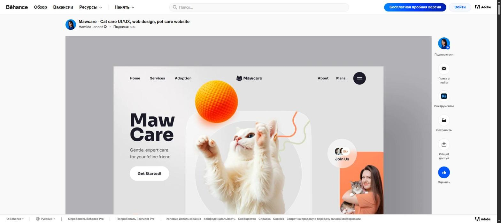
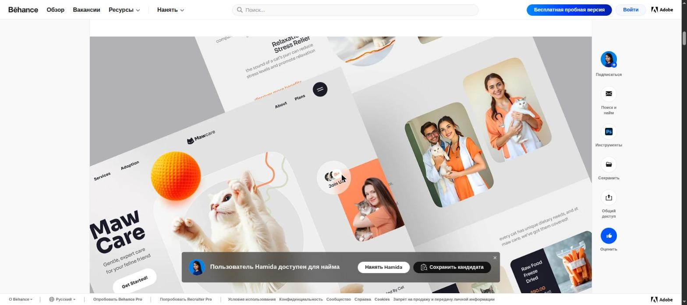
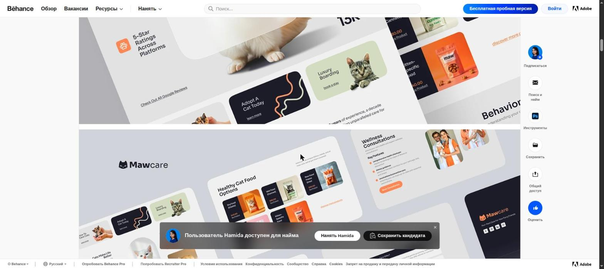
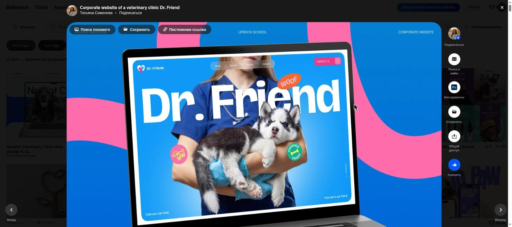
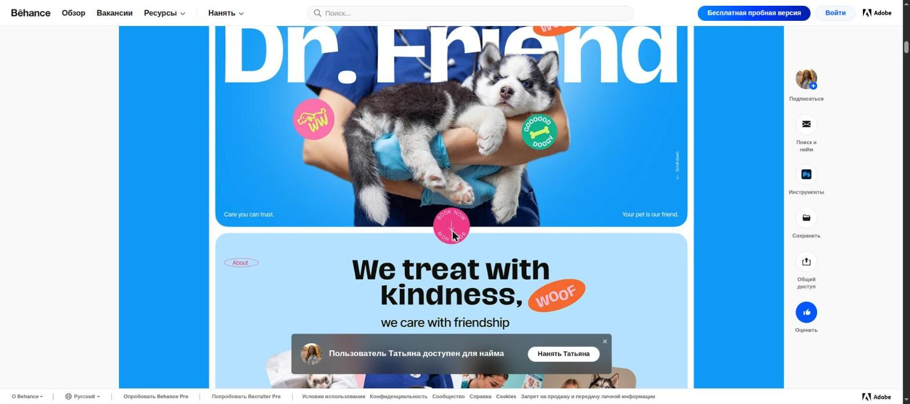
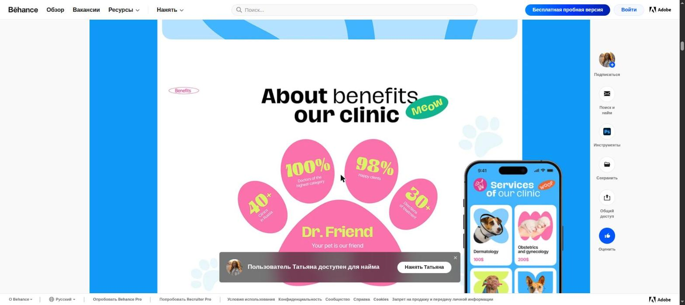
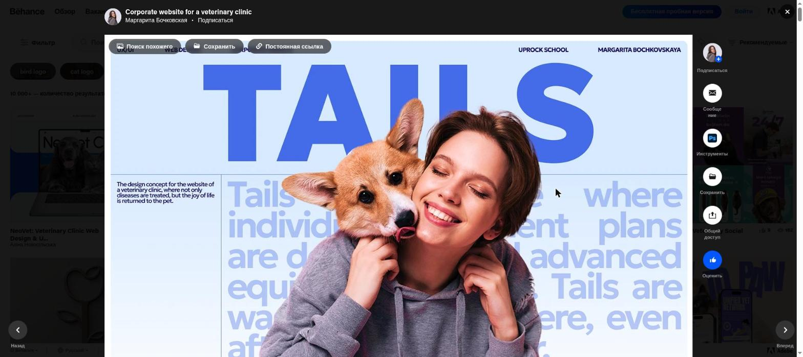
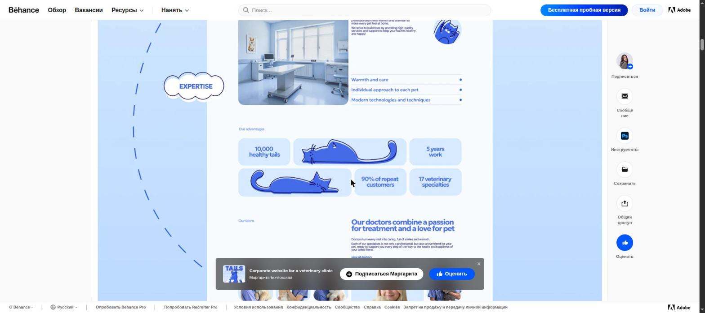

# Мудборд — референсы (веб-дизайн)

Дата: 2026-07-18, обновлено 2026-07-19. История ревизий:
- v1 — подборка с Behance, но это оказались презентации графики/айдентики, а не сайты.
- v2 — заменил на живые сайты (Kindred Pet Care, charity: water, Together for Animals). По фидбэку — визуально слишком простые/пресные, недостаточно «нескучные».
- v3 (эта версия) — снова Behance, но на этот раз отобраны именно **полноценные веб-дизайны** (макеты целого сайта: hero, секции, мобильная версия), а не бренд-айдентика или иконки. Критерий отбора: смелый, нетиповой визуал + читаемая структура (не просто красивая картинка без иерархии).

---

## 1. Mawcare — Cat care UI/UX, web design

[Hamida Jannat, Behance](https://www.behance.net/gallery/216444675/Mawcare-Cat-care-UIUX-web-design-pet-care-website)

Полный макет сайта премиального кэт-кэра. Крупный жирный округлый леттеринг («MawCare») вместо логотипа-картинки, объёмный 3D-рендер оранжевого мяча-игрушки, вырезанное по контуру фото кошки без фона (не прямоугольная фотография). Карточки услуг («Adopt A Cat Today», «Luxury Boarding») — на тёмно-синем и оливковом фоне вперемешку со светлыми, а не все одного цвета. Внизу — сетка товаров (корм) и фото врачей в оранжевой форме. Акцент — один яркий оранжево-коралловый цвет на нейтральном светло-сером/тёмно-синем фоне.

**Подходит нам?** Главный урок — **вырезанные по контуру фото животных без фона** вместо фото в рамке/скруглённом прямоугольнике: сразу выглядит менее «шаблонно», играет с 3D-реквизитом (мяч) рядом. Чередование тёмных и светлых карточек в одной сетке услуг — тоже недорогой приём, чтобы сетка не выглядела монотонно. Оранжевый как акцент не берём (у нас фиолетовый), но формулу «один яркий акцент на спокойном фоне» — да.

## 2. Dr. Friend — Corporate website of a veterinary clinic

[Татьяна Симонова, Behance](https://www.behance.net/gallery/234975559/Corporate-website-of-a-veterinary-clinic-Dr-Friend)

Это буквально ветклиника — по теме максимально близко к нам. Крупная органичная «клякса»-волна розового цвета на синем фоне под hero-фото. Поверх настоящего фото врача с щенком — россыпь круглых стикеров-бейджей («WOOF», «GOOD DOGGY», лапка) — как будто их налепили руками, а не аккуратные иконки в кружках. Статистика клиники (98% довольных клиентов, 40+ клиник) подана не таблицей, а в виде **лапы**, собранной из розовых кругов-подушечек — цифра внутри каждой подушечки. Кислотный лайм-зелёный используется точечно как третий акцент рядом с розовым и синим.

**Подходит нам?** Приём «стикеры-наклейки поверх фото» и «цифры статистики внутри формы, связанной с темой (лапа)» — два конкретных, недорогих в реализации способа не выглядеть как дефолтный shadcn-лендинг. У клиники уже есть похожий паттерн «иконка в кружке» для УТП (см. `ui-design-system.md`) — здесь показано, как его продвинуть на шаг дальше: не просто иконка, а форма-контейнер, тематически связанная с брендом (у нас это мог бы быть силуэт лошадь+кот+собака из лого вместо лапы).

## 3. TAILS — Corporate website for a veterinary clinic

[Маргарита Бочковская, Behance](https://www.behance.net/gallery/223923373/Corporate-website-for-a-veterinary-clinic)

Монохромная **синяя** палитра почти на весь сайт (не мультиколор) — редкое решение для petcare-темы, обычно там пестрят 3-4 цвета. Hero: собственное имя бренда «TAILS» набрано гигантским кеглем и наполовину скрыто за фото девушки с корги — тот же приём «крупная типографика поверх фото», что был в референсе Kindred Pet Care из предыдущей версии мудборда, но здесь реализован смелее (текст обрезан фотографией, а не просто наложен). Дальше по странице — кастомные плоские line-art иллюстрации кота в вытянутых позах внутри статистических карточек («10,000 healthy tails», «5 years work») вместо иконостока, облачные бейджи-подписи («EXPERTISE»), пунктирная линия-проводник между блоками.

**Подходит нам?** Показывает, что достаточно **одного** цвета (не считая нейтральных), чтобы сайт не выглядел бедно — важный аргумент в пользу того, чтобы не тянуть в проект второй-третий брендовый цвет ради «разнообразия». Кастомная line-art иллюстрация животного как декоративный элемент статистики — приём, который стоит взять: нарисовать в похожем стиле силуэт из лого клиники (лошадь+кот+собака), а не использовать сток.

---

## Рекомендация

Общее между всеми тремя референсами: это не абстрактная бренд-графика, а **рабочая структура сайта** (hero → УТП/статистика → услуги → команда → футер) с одним смелым визуальным приёмом на каждую секцию, а не десятью средними. Переносим на фиолетовую палитру клиники (`--brand-primary #6E2C8C`, `--brand-accent #B5459C`, `--brand-cream #FBF7F5` из `ui-design-system.md`):

1. **Фото животных/врачей клиники вырезанные по контуру**, без прямоугольной рамки (Mawcare) — для hero и карточек команды, если у клиники есть фото на светлом/нейтральном фоне или их можно вырезать
2. **Органичная клякса-волна фиолетового цвета** как фон hero-секции вместо плоской заливки или прямоугольного фото (Dr. Friend)
3. **Статистика клиники в тематической форме**, не в таблице — силуэт лошадь+кот+собака из лого, собранный из 3 «долек» с цифрами (рейтинг 2ГИС, лет работы, довольных пациентов) вместо сухих цифр в ряд (Dr. Friend)
4. **Один акцентный цвет на весь сайт**, вторым — только нейтральный (кремовый/тёмный текст), без дополнительных ярких цветов ради «разнообразия» (TAILS) — фиолетовый уже достаточно насыщен, чтобы не выглядеть бедно
5. **Кастомная line-art иллюстрация мотива из лого** (силуэт лошадь+кот+собака) как декоративный повторяющийся элемент — в статах, в разделителях секций, в пустых состояниях (TAILS + идея «повторяющегося мотива» из предыдущей версии мудборда, референс La Compagnie des Animaux)
6. **Стикеры-«наклейки» поверх hero-фото** вместо строгих иконок в кружках — можно сделать 2-3 таких бейджа с короткими фразами по-русски («Настоящие люди», «4.9 в 2ГИС») (Dr. Friend)

Ничего из этого не требует нового цвета или ребрендинга — все три референса показывают, как **один** акцентный цвет плюс нестандартная форма подачи (вырезанные фото, тематические статы, кляксы, стикеры) дают нескучный результат без отказа от уже сложившейся фиолетовой палитры клиники.
